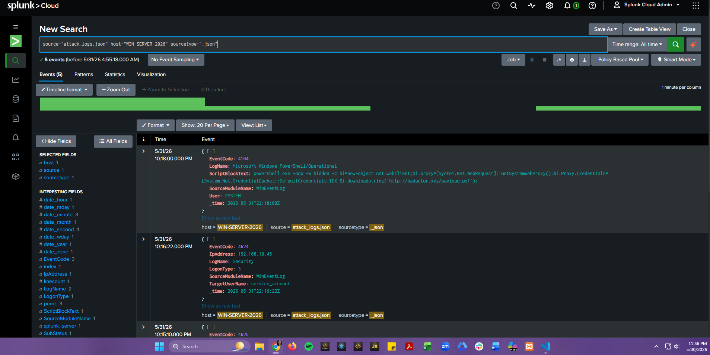
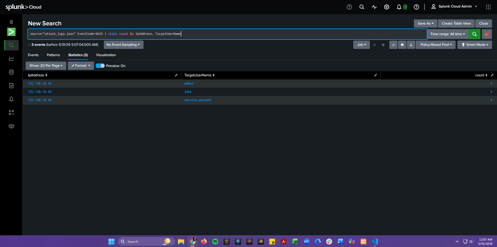
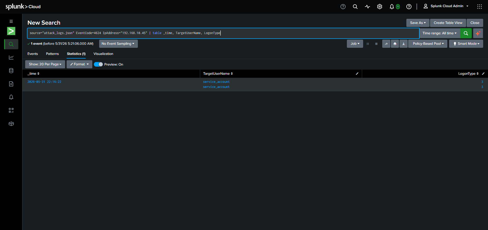
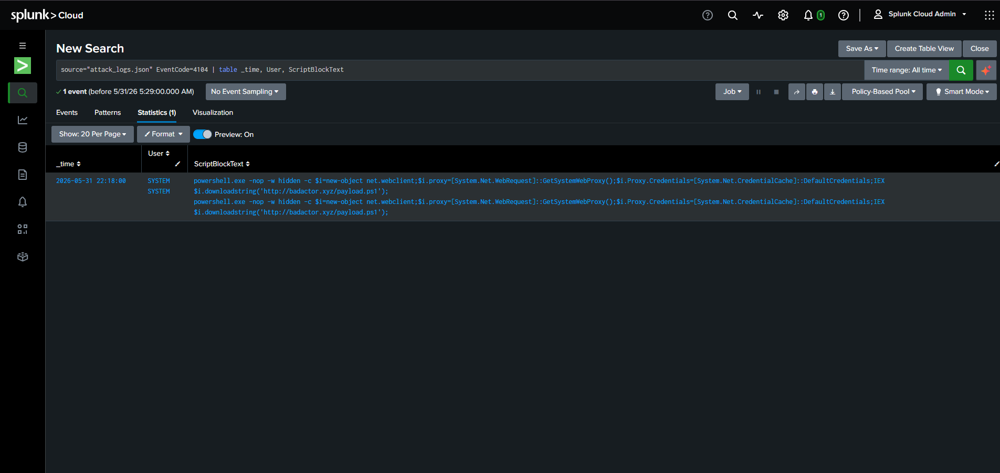

# Cloud SIEM Triage Lab

This project shows how I used Splunk Cloud to investigate a simulated Windows intrusion from raw log ingestion through attacker timeline reconstruction, compromised-account identification, and malicious PowerShell analysis.

For recruiters and hiring teams, this lab demonstrates practical SOC analyst skills: log triage, SPL query writing, authentication-event analysis, incident scoping, MITRE ATT&CK mapping, and concise security reporting.

## Project Snapshot

| Area | Details |
| --- | --- |
| Role | SOC Analyst / Threat Hunter |
| Platform | Splunk Cloud Platform |
| Data Source | Windows Security Event logs in JSON format |
| Host Investigated | `WIN-SERVER-2026` |
| Key Event IDs | `4625`, `4624`, `4104` |
| Outcome | Confirmed credential-spraying activity, identified the compromised account, and deobfuscated post-compromise PowerShell activity |

## What This Project Demonstrates

- Ingesting and validating endpoint security telemetry in a SIEM
- Writing SPL queries to isolate suspicious authentication patterns
- Correlating failed logons, successful logons, and PowerShell execution
- Tracing an intrusion from initial access to post-exploitation behavior
- Translating technical findings into concise, actionable remediation steps

## Investigation Summary

### 1. Validated raw telemetry ingestion
I onboarded `attack_logs.json` into Splunk Cloud, verified field extraction, and confirmed the logs were searchable and time-aligned for analysis.

### 2. Detected credential-spraying activity
Using Windows failed-logon events (`EventCode=4625`), I identified repeated authentication failures tied to a single source IP, indicating brute-force or credential-spraying behavior.

### 3. Confirmed the successful compromise
I pivoted from failed logons to successful logons (`EventCode=4624`) and confirmed that the attacker IP `192.168.10.45` successfully authenticated to `service_account` using Logon Type 3, establishing initial access.

### 4. Investigated post-compromise activity
I reviewed PowerShell Script Block Logging (`EventCode=4104`) and identified a malicious command using `Net.WebClient` and `IEX` to download and execute a remote payload from `badactor.xyz`, indicating command-and-control staging and in-memory execution.

## Key Findings

- Source IP `192.168.10.45` generated repeated failed logons against multiple users
- The compromised account was `service_account`
- Successful access occurred on `2026-05-31 22:16:22`
- The attacker used PowerShell to fetch and execute a remote payload
- The behavior aligns with brute force, initial access, and PowerShell-based execution techniques

## SPL Queries Used

### Failed logon analysis
```spl
source="attack_logs.json" EventCode=4625
| stats count by IpAddress, TargetUserName
```

### Successful logon confirmation
```spl
source="attack_logs.json" EventCode=4624 IpAddress="192.168.10.45"
| table _time, TargetUserName, LogonType
```

### PowerShell execution review
```spl
source="attack_logs.json" EventCode=4104
| table _time, User, ScriptBlockText
```

## MITRE ATT&CK Alignment

| Tactic / Technique | Relevance |
| --- | --- |
| `TA0001` Initial Access | Successful authentication from the attacker IP established the breach |
| `T1110` Brute Force | Repeated failed logons suggest credential spraying or password guessing |
| `T1059.001` PowerShell | The attacker executed PowerShell to pull and run a remote payload |

## Screenshots

### Raw telemetry validation in Splunk


This view confirms the source data was ingested correctly and available for investigation.

### Failed logon statistics


This query highlights the attacker IP and the user accounts targeted during the credential-spraying phase.

### Successful logon verification


This result isolates the successful compromise and identifies the affected account.

### PowerShell execution audit


This output captures the malicious PowerShell execution used for post-compromise payload delivery.

## Recommendations

1. Reset and rotate credentials for `service_account`, then review its privileges.
2. Block inbound activity from `192.168.10.45` and deny outbound communication to `badactor.xyz`.
3. Restrict service accounts from remote network logons unless explicitly required.
4. Enable or retain PowerShell logging and alert on suspicious `IEX`, hidden-window, or web-download patterns.

## Recruiter Takeaway

This project reflects the kind of work expected in an entry-level or junior SOC role: turning raw security telemetry into a defendable incident narrative, identifying attacker behavior quickly, and communicating clear remediation steps that a security team can act on.
